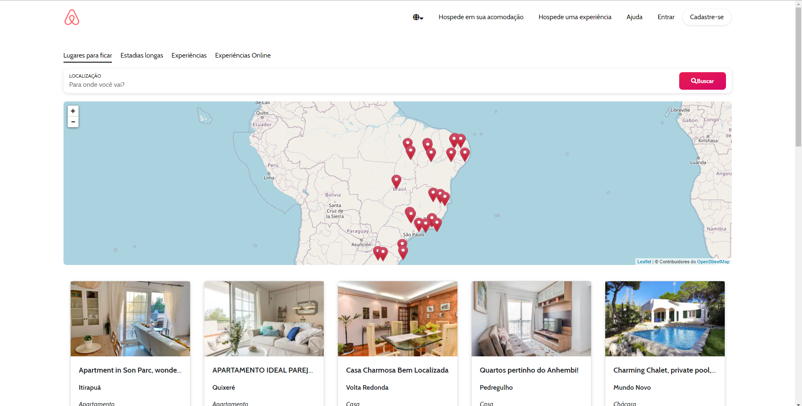
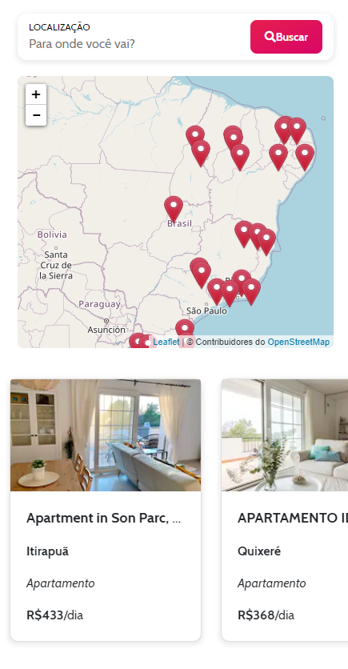

## Desafio Airbnb - Gama Academy

### O que foi utilizado
- Vanilla JS
- HTML
- CSS
- Flexbox
- Bootstrap
- [Leaflet](https://leafletjs.com/)

### O projeto
No desktop:

No mobile:

### Sobre o desafio
O desafio é criar uma página similar a do Airbnb através do consumo da API de quartos, usando Javascript Vanilla e Flexbox para organizá-los em cards na tela, a partir [deste banco de dados aqui](https://api.sheety.co/30b6e400-9023-4a15-8e6c-16aa4e3b1e72).

#### Resultados esperados
Tela com cards contendo:
- Imagem
- Tipo de propriedade
- Preço

**Para ir além...**

Pensando em uma melhor experiência, você ainda pode adicionar outras funcionalidades. Aqui vão alguns exemplos:

**Limite de itens por página** - Paginar o resultado da API para que limite o número de items por página para não sobrecarregar o navegador, aumentando assim a performance do site para os usuários;

**Filtro de localização** - criar um filtro que exiba apenas os locais baseados na localização que o usuário configurar na busca - vocês precisarão criar uma nova base de dados com localização, desafiem-se!

**API do Google Maps** - Utilizando a API do Google Maps, é possível incluir pins onde o imóvel fica localizado no mapa, deixando assim bem mais fácil a visualização geográfica;
Valor total da estadia - a partir do input de check-in e check-out de usuários, o sistema pode calcular o número de estadias e mostrar uma prévia do valor total de hospedagem.